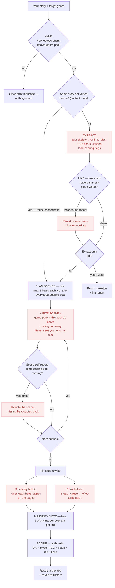
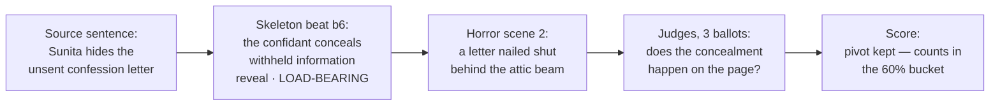

# How the Genre Converter works, step by step

This is the plain-English tour of what happens between "Convert story" and the
finished rewrite. The same walkthrough lives inside the app — the **"How it
works"** button on the Story Rewrite Engine tab opens it as an interactive
flowchart. For the deeper design discussion see `ARCHITECTURE.md`; for the
scoring methodology see `METRICS.md`.

**The one-sentence version:** the pipeline pulls the plot out of your story,
throws away everything else, rewrites that plot in a new genre one scene at a
time, and then checks — beat by beat, with independent judges — how much of the
plot survived.

Every model call is Gemini (`gemini-3.5-flash` by default, on the `global` Vertex
location) on Vertex AI. The whole run takes a few minutes for a short story.

## The whole pipeline at a glance

Red boxes are model calls (they cost tokens and time); everything else is free
code. The two loops — the lint re-ask and the scene retry — each run at most
once.

---

## Step 0 — Your story arrives

You paste text (or upload a `.txt`) and press **Convert story**.

1. The browser sends the text and your chosen genre to `POST /api/convert`.
2. The service checks the basics before spending anything: at least 400
   characters (shorter has no plot to extract), and the genre must be one of
   the packs on disk (`anime`, `comedy`, `horror`, `romance`, `thriller`).
   Up to 60,000 characters the job runs this scene-by-scene pipeline; past
   that it switches to the chapter-based long-form lane (see `LONGFORM.md`).
3. It creates a **job** with an id and returns it immediately — the work is far
   too long to hold a web request open. The browser then polls
   `GET /api/jobs/{id}` (every 20 seconds at first, tightening to 5 seconds as
   the job nears the finish line) and renders whatever the job has published so
   far: progress notes, an activity log, the skeleton, and each scene as it is
   written.
4. **Caching:** the story text is hashed. If this exact story was extracted
   before, the skeleton is reused for free; if this exact story + genre was
   converted before, the rewrite is reused too. That is why a repeat run
   finishes in seconds.

---

## Step 1 — Extract: pull out the plot, throw away the genre

*What you see in the UI: "Extracting the plot skeleton".*

One model call reads the whole story and produces a **plot skeleton** — a
structured, deliberately boring description of what happens:

- **Logline** — one sentence: who wants what, what stands in the way. No names.
- **Roles** — each character reduced to their *function* (`protagonist`,
  `gatekeeper`, `betrayer`…). The only place the character's real name is kept
  is a lookup field, so the verifier can talk about them later.
- **Beats** — the story cut into 8–15 causal units. Each beat says: which role
  acts, what they do (in flat, courtroom language), what the outcome is
  (success / failure / reversal / reveal / status quo), and which later beats
  it **causes**.
- **Load-bearing flags** — a beat is marked load-bearing only if deleting it
  would change the ending. Most stories have 3–6 of these. They are the beats
  the score cares about most.

The extraction rules are strict on purpose: **no proper nouns, no genre words,
no sensory detail**. Anything left in the skeleton is something the rewrite is
*not allowed to change* — so the skeleton must contain the plot and nothing
else. A withheld letter must become "the confidant withholds the leverage",
because in the horror version it might be a curse and in the comedy version an
unsent text message.

**The lint (free, no model):** plain Python then scans the skeleton for leaks —
character names that slipped through, genre-loaded words ("dread", "tender",
"hilarious"…), beats that reference roles or beat-ids that don't exist. If it
finds any, the extractor is asked **once** to redo the wording (same beats,
same ids, same flags — only the leaky words change). Remaining complaints are
reported rather than fatal.

If you pressed **Extract skeleton only**, the job ends here and you get the
skeleton and the lint report. That's the ~20-second path.

---

## Step 2 — Rewrite: one scene at a time, never all at once

*What you see in the UI: "Writing the rewrite, scene by scene".*

### 2a. Plan the scenes (instant, no model)

The beats are grouped into scenes by a simple deterministic rule: **at most 3
beats per scene, and always cut right after a load-bearing beat** — so no scene
ever has to land two pivotal moments, because a scene with two turns in it
always short-changes one. Because this is pure arithmetic, the service knows
the total scene count up front, which is what makes the progress bar honest.

### 2b. Write each scene (one model call per scene)

Each call gets exactly three things:

1. **The genre pack** — a JSON "brief" describing the target genre: its core
   premise, pacing, point-of-view distance, dialogue register, a sensory
   palette, the moves a reader expects, and — most importantly — the **taboo
   moves** that would break the genre. Prohibitions are what keep horror from
   drifting into thriller.
2. **The plot spine** — only the 1–3 beats this scene owns, with their causal
   links and `[PIVOTAL]` markers.
3. **A rolling summary** — two or three sentences written by the *previous*
   scene's call: the names it invented, where we are, what just changed. This
   is the only continuity thread; the model never sees the other scenes.

Crucially, the writer **never sees your original story** — only the skeleton.
There is no surface detail available to copy, which is what forces a genuinely
new telling instead of a find-and-replace.

The last scene is explicitly told "the story ends here — land it."

### 2c. Trust, but verify each scene

Each scene call also self-reports which beats it actually put on the page. If
a **load-bearing** beat is missing from that report, the scene is rewritten
**once**, with the missing beat quoted back ("make it actually happen on the
page rather than being alluded to"). Supporting beats are not worth a retry's
wall-clock — the final verification will report them either way.

Every finished scene is published to the job immediately, which is why you can
start reading the rewrite minutes before the job finishes.

---

## Step 3 — Verify: did the plot survive?

*What you see in the UI: "Checking every beat against the page".*

The finished prose is now judged against the **source** skeleton — the one
extracted from *your* story. Two kinds of question are asked, and each is asked
**three times independently** (six model calls, run concurrently):

- **Delivery ballots (×3):** given the full rewritten prose and the list of
  source beats, does each beat *actually happen on the page*? The judge is told
  to ignore costume (a withheld document and a withheld confession are the same
  withholding) but to be strict about substance: recollection is not
  occurrence, foreshadowing doesn't count, the wrong actor doesn't count, and
  an inverted outcome (a refusal became an acceptance) definitely doesn't
  count.
- **Causal-link ballots (×3):** for each "beat A causes beat B" edge in the
  source, is that link still *legible* in the prose — does the second thing
  still visibly happen because of the first?

Then a plain-Python **majority vote** merges each set of ballots: a beat counts
as delivered only if at least 2 of 3 judges found it. Voting exists because a
single judgement call isn't reproducible — the same comparison once scored 68%
and 93% on different runs; three votes turn a shaky instrument into a stable
one.

### The score

The fidelity number is deterministic arithmetic over the merged votes:

| Component | Weight | Question |
|---|---|---|
| Load-bearing recall | **60%** | Did the beats the story collapses without survive? |
| All-beat recall | 20% | Did the rest of the plot survive? |
| Causal-edge recall | 20% | Do things still happen *because of* other things? |

So **fidelity = 0.6 × load-bearing + 0.2 × beats + 0.2 × edges** (weights
renormalise if a story has, say, no causal edges to measure). The report also
lists exactly *which* load-bearing beats never made the page (with the judges'
reasons) and which causal links broke — that's what the Fidelity tab shows.

Don't read the number against 100%: even re-extracting the *original* story
and comparing it to itself doesn't score perfect, because decomposition is
slightly lossy. `calibrate.py` measures that ceiling.

---

## Step 4 — Finish and remember

The job flips to `done` with the full result: the rewritten story, its word
count, the fidelity breakdown, the source skeleton, and the elapsed time. The
service also writes the whole thing (input story, skeleton, rewrite, scores)
into its **history** store, keyed by story+genre — that's what the History tab
in the studio lists via `GET /api/history`. Re-converting the same story to the
same genre refreshes its record instead of duplicating it. History lives with
the service instance (it survives day-to-day, but not a redeploy).

---

## One beat, end to end (worked example)

The easiest way to understand the pipeline is to follow a single plot moment
through it. Take this sentence from a family drama:

> *"Sunita finds her brother's unsent confession letter in the attic and hides
> it from the family."*

Step by step:

1. **Extract** turns it into beat `b6`: *"the confidant discovers withheld
   information and conceals it from the group"* — outcome `reveal`, causes
   `b9`, load-bearing. No Sunita, no attic, no letter: just the move. That
   abstraction is the whole trick — it's what lets every genre reinvent the
   surface.
2. **Lint** catches the first draft writing "Sunita conceals…" (a leaked name)
   and re-asks once. Same beat, cleaner wording.
3. **Plan** puts `b6` at the end of scene 2, because a load-bearing beat always
   closes its scene — a scene never has to land two pivots.
4. **Write** renders the same move differently per genre:
   - *horror* — "The letter was nailed shut behind the attic beam, and Mira
     understood, resealing it, that some confessions are kept the way graves
     are kept."
   - *comedy* — "Priya found the draft. Forty-seven versions of the same
     unsent text, each one worse. She did the only responsible thing: archive,
     airplane mode, denial."

   Same role, same concealment, same turn — different everything else.
5. **The self-check** would catch scene 2 forgetting to dramatise `b6` and
   rewrite it once with the beat quoted back.
6. **Verify** is strict about what counts. If the rewrite only says *"Mira
   remembered hiding the letter years ago"* — verdict: **not delivered**
   (recollection is not occurrence), 0/3 votes. Hidden on the page in scene 2:
   delivered, 3/3.
7. **Score**: suppose the run keeps 3 of 4 load-bearing beats, 4 of 5 beats
   overall, and all 4 causal links. Fidelity =
   `0.6 × 0.75 + 0.2 × 0.80 + 0.2 × 1.00` = **76%**, and the report names the
   dropped pivot and the judges' reason.

---

## Why it takes five to eight minutes

Roughly: extraction is 1 model call (+1 if the lint re-asks), the rewrite is 1
call per scene (typically 4–7 scenes, ~30–60s each, occasionally doubled by a
retry), and verification is 6 concurrent calls. The rewrite dominates. Nothing
is idle time — the UI's activity log is a live feed of exactly these calls.

## Where each step lives in the code

| Step | File |
|---|---|
| HTTP service, jobs, polling, history | `api.py` |
| Skeleton shape (the contract) | `models.py` |
| Step 1: extraction + lint | `extract.py` |
| Step 2: scene planning + rewriting | `transform.py` |
| Genre briefs (data, not code) | `genre_pack.py` + `genres/*.json` |
| Per-scene "did it land on the page" checks | `delivery.py` |
| Step 3: ballots, voting, scoring | `verify.py` |
| Skeleton/rewrite cache | `cache.py` |
| The single Gemini/Vertex touchpoint | `llm.py` |
